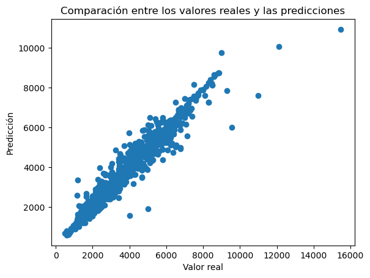

# Predicción del precio de laptops.

**Prueba técnica de la compañia ALLEGRO**

Proyecto de machine learning usando diferentes modelos de regresión para predecir el precio de portatiles. Prueba técnica para la compañia ALLEGRO. 

## Índice

1. [Introducción](#introducción)
2. [Estructura](#estructura)
3. [Resultados](#resultados)

## Introducción

EL siguiente proyecto tiene como objetivo predecir el precio de un determinado ordenador portátil en función de sus características. La idea principal es utilizar diferentes modelos de machine learning y utilizar las métricas MSE (error absoluto medio) y el coeficiente de derminación \( R^2 \). Como valores de entrada, se han proporcionado tres archivos .json.

## Estructura

Se puede dividir el proyecto en dos partes diferenciadas. La primera son los notebooks, donde se fusionan los archivos .json y se procede a su limpieza para el posterior uso de los modelos. La segunda parte, y pensando en la posibilidad de incluir el proyecto en una app o para integraciones continuas, se ha automatizado el proceso de ingesta y entrenamiento de datos, para poder hacer uso del mejor modelo ya entrenado, para predecir valores futuros. 

#### Primera parte. Notebooks.
Dentro de la primera parte, los notebooks, se tienen dos archivos .ipynb:

- data_clean: En esta primera parte se unen los diferentes archivos, se eliminan nulos, se codifican los valores categóricos y se escalan los valores para su uso posterior.
- models: En este notebook se divide el dataframe obtenido en el notebook anterior para su entrenamiento y test, y se prueban los algoritmos Random Forest y linear regression. Se calculan las métricas MAE y \( R^2 \) y se hace una grafica comparando los valores reales con los predichos por el modelo.

#### Segunda parte. Automatización.

En la segunda parte, se ha seguido una estructura que permita automatizar el proceso de ingestión y entrenamiento de datos, nos permite usar un modelo, y se define un pipeline para poder utilizar nuevos datos sobre el modelo guardado. Todos los scripts se definen dentro de la carpeta **src**. La estructura es como sigue:

- /components: En esta carpeta se definen los scripts para la ingestion de los datos al sistema (data_ingestion.py) y el entrenamiento de los modelos (trainer.py)
- /pipeline: En esta carpeta se definen los scripts que contienen los pipelines para ingesta y entrenamiento del modelo (train_pipeline.py) y para la predicción de nuevos datos (predict_pipeline.py)
- exception.py: Se define un custom exception que nos indica en qué archivo hay un error, número de línea y contenido del error.
- utils.py: Se definen algunos métodos para la carga de datos, el guardado de modelo o la evaluación.

## Resultados

En el notebook models, se han probado dos modelos distintos, RandomForest y linearRegression. Los mejores resultados han sido los obtenidos por el modelo random forest:

Y las métricas obtenidas: 

| Algoritmo             | MAE     | MSE   | \( R^2 \) |
|-----------------------|---------|-------|-----------|
| RandomForest          | 245.33  | 187616.38|0.9357     |

